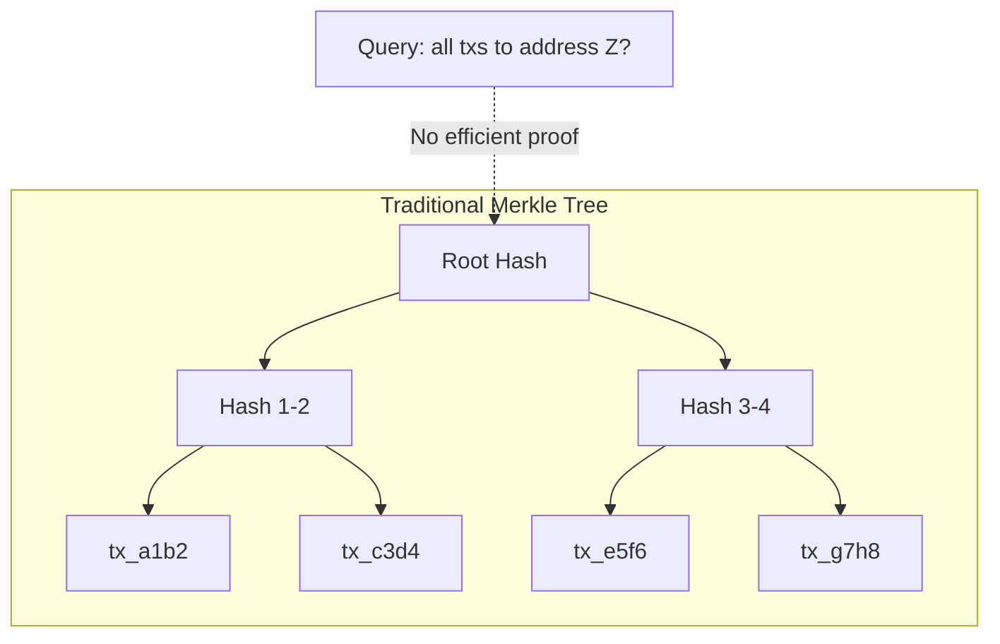
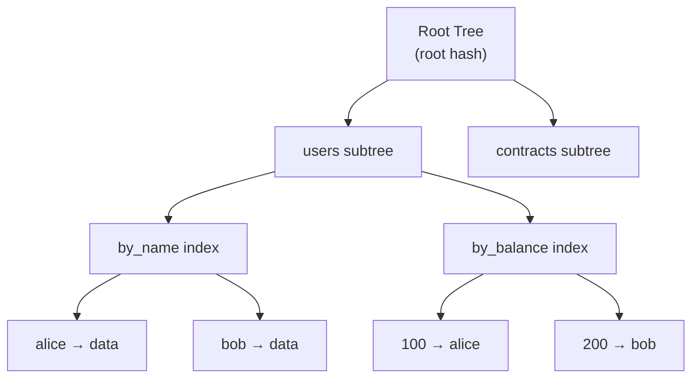

# What Is GroveDB?

GroveDB is a hierarchical authenticated database. It organizes data as trees within trees, where a single 32-byte root hash cryptographically commits to the entire database state. Any query result — including range queries and secondary index lookups — can be proven correct against that root hash.

## State Commitments You Already Know

In Bitcoin, the block header commits to all transactions via a Merkle root. A light client with just the 80-byte header can verify that a specific transaction is included in a block by checking a Merkle proof — a logarithmic-sized path of sibling hashes from the transaction to the root. No trust in the full node required.

Ethereum extends this with a state trie root in each block header, committing to the entire world state: every account balance, every contract storage slot. Light clients can verify individual account lookups against this root.

These are **provable data structures** — the root hash commits to all stored data, so any query result can be verified without trusting the data source.

GroveDB generalizes this pattern.

## The Limitation of Flat Merkle Trees

A standard Merkle tree proves "transaction X is in block Y." But it can't efficiently prove queries like:

- "Show me all transactions to address Z"
- "What is the balance of every account with more than 100 coins?"
- "List all documents owned by this identity, sorted by creation date"

These are **secondary index queries**. A flat Merkle tree can't prove them. You can prove a single key lookup, but proving that a range query returned *complete* results — that nothing was omitted — requires a different structure.

## GroveDB's Solution: A Grove of Trees

GroveDB's core idea: **trees within trees**. Each subtree is its own Merkle tree, and its root hash is stored as a node in the parent tree. One root hash at the top commits to everything.

Secondary indexes become subtrees that can be queried and proven independently. Need to prove "all users with balance > 100"? The `by_balance` index is a subtree. Query it, generate a Merkle proof within that subtree, then chain proofs up through the hierarchy to the root. The verifier checks the proof against the root hash from the block header. Done.

## Key Capabilities

- **Secondary index queries with proofs** — range queries, exact lookups, and compound predicates, all provable against a single root hash
- **Inclusion and absence proofs** — prove a key exists *or* prove it doesn't (essential for "this account has no outstanding debt" type queries)
- **Range proofs** — prove all keys in a range, with completeness (nothing was omitted)
- **Hierarchical subqueries** — query across multiple levels of the tree hierarchy in a single operation
- **ACID transactions** — optimistic transactions with atomic commit/rollback
- **Sum trees** — subtrees that automatically maintain running sums of their children, queryable and provable
- **Operation cost metering** — every operation reports storage, seek, and hash costs for fee calculation

## GroveDB for C++

The C++ library (`libgrovedb`) provides idiomatic C++20 bindings over the Rust GroveDB engine via FFI. The Rust toolchain builds the core engine; your application code is pure C++.

Key design choices:

- **`grovedb::Result<T, Error>` return types** — every operation returns `grovedb::Result<T, Error>`. You can check results imperatively with `if`/`else`, or chain operations with `.and_then()` and `.map()` — particularly useful when unwrapping complex nested types and ensuring validation steps aren't skipped. See [Error Handling](11-error-handling.md).
- **Move-only handles** — `Db` and `Transaction` are move-only RAII types. Transactions auto-rollback on destruction if not committed.
- **Full proof support** — generate and verify proofs for any query, including absence proofs and chained multi-query verification.
- **Cost tracking** — every mutation and query returns an `OperationCost` with seek counts, storage bytes, and hash operations, feeding directly into blockchain fee markets.

**Origin**: GroveDB was created by [Dash Platform](https://dashplatform.readme.io/) for decentralized application state management. The underlying tree-of-trees structure and its security properties are described in Etemad & Kupcu, "Database Outsourcing with Hierarchical Authenticated Data Structures" (2015).
