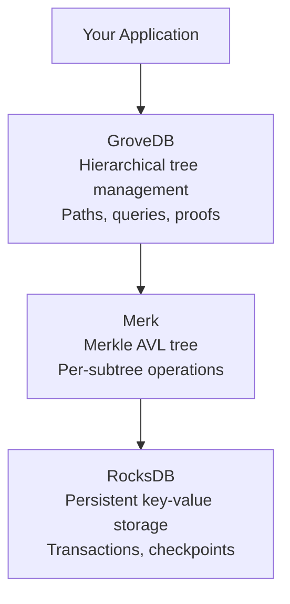
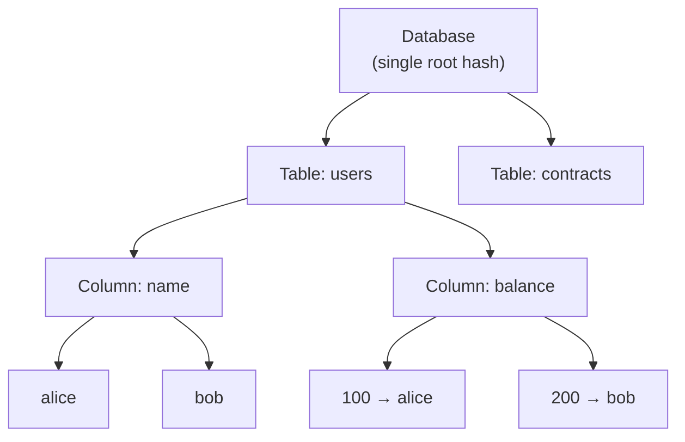
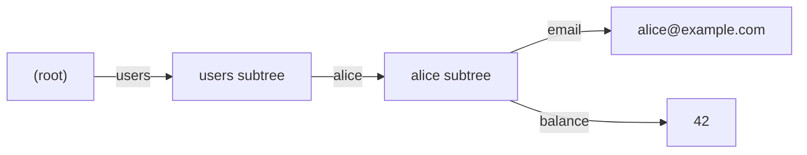
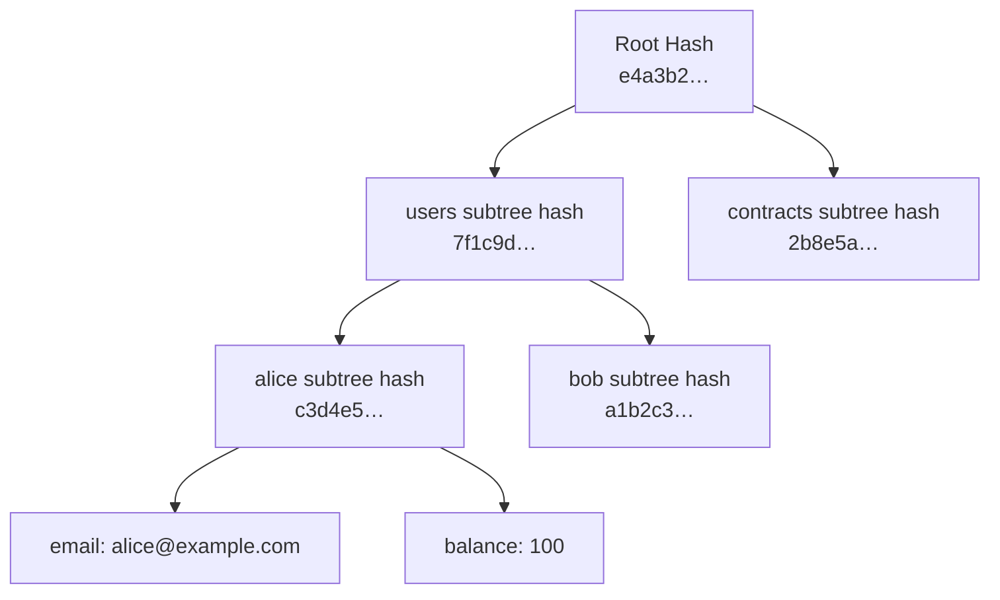

# Architecture

## The Stack

GroveDB is built in three layers, each with a clear responsibility:



If you've used RocksDB (or LevelDB) directly, Merk is like building a self-balancing Merkle tree on top of that key-value store. GroveDB then organizes multiple such trees into a hierarchy with cross-tree proofs.

## The Hierarchy: Trees Within Trees

GroveDB organizes data as nested subtrees — trees within trees. You define the hierarchy; GroveDB doesn't enforce a schema. It provides the machinery for provable hierarchical storage.

A common pattern is a four-level model:



The flexibility is that *you* define how many levels, what each level represents, and how keys are organized. GroveDB provides the provable tree-of-trees infrastructure.

## Merk Trees

Every subtree in GroveDB is a **Merk tree** — a Merkle AVL tree. Key properties:

- **O(log n) operations** — insert, delete, lookup, and proof generation are all logarithmic
- **Sorted keys** — AVL trees maintain key order, enabling efficient range queries and range proofs
- **Concurrent multi-core operations** — unlike IAVL (used by Cosmos SDK) which is single-threaded, Merk supports concurrent operations
- **Checkpointing without blocking** — create read-only snapshots without halting writes

Each Merk tree independently computes its own root hash. The parent tree stores that hash as the value of the subtree element. Changes propagate upward: modifying a leaf causes hash recomputation up through every ancestor to the database root.

## Paths and Keys

Navigation in GroveDB uses two concepts:

- **[`Path`](@ref grovedb::Path)** — a sequence of byte segments navigating the subtree hierarchy (`std::vector<`[`Bytes`](@ref grovedb::Bytes)`>`)
- **Key** — an identifier within a single subtree ([`Bytes`](@ref grovedb::Bytes))



In code:

```cpp
// Path to the "alice" subtree
grovedb::Path alice_path{
  grovedb::Bytes::FromString("users"),
  grovedb::Bytes::FromString("alice")
};

// Key within that subtree
auto key = grovedb::Bytes::FromString("email");

// Together they address "alice@example.com"
auto result = db.Get(alice_path, key);
```

If you think of the UTXO database as a flat key-value store, GroveDB is a *hierarchical* key-value store where you navigate a tree of trees. The empty path `{}` addresses the root tree.

## Root Hash

A single 32-byte [`Hash`](@ref grovedb::Hash) commits to the entire database state:

```cpp
auto root_hash = db.GetRootHash();
// root_hash->value() is a Hash (std::array<uint8_t, 32>)
```

Any change to any element anywhere in the hierarchy causes the root hash to change. This is the same principle as a Bitcoin block header's Merkle root — but extended to a tree of trees.



Changing Alice's email changes her subtree hash, which changes the users subtree hash, which changes the root hash. The root hash in a block header therefore commits to every piece of data in the database.

## Optimistic Transactions

GroveDB wraps RocksDB's optimistic transaction model: operations proceed without acquiring locks, and conflicts are detected at commit time. This mirrors how block processing typically works — one thread processes a block's state transitions, then commits atomically. Contention is rare.

Similar to RocksDB's `WriteBatch`, but with conflict detection and automatic rollback:

```cpp
auto txn = db.BeginTransaction();
db.Put(path, key, element, *txn);  // No locks acquired
auto commit_result = db.Commit(*txn);  // Conflict check happens here
```

If the transaction is destroyed without commit, changes are automatically rolled back via RAII.

See [Transactions](08-transactions.md) for the full lifecycle.
