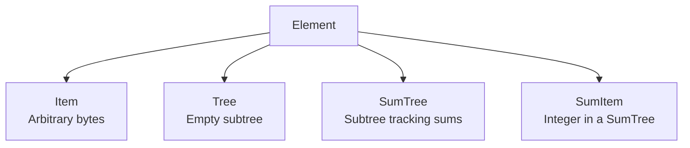
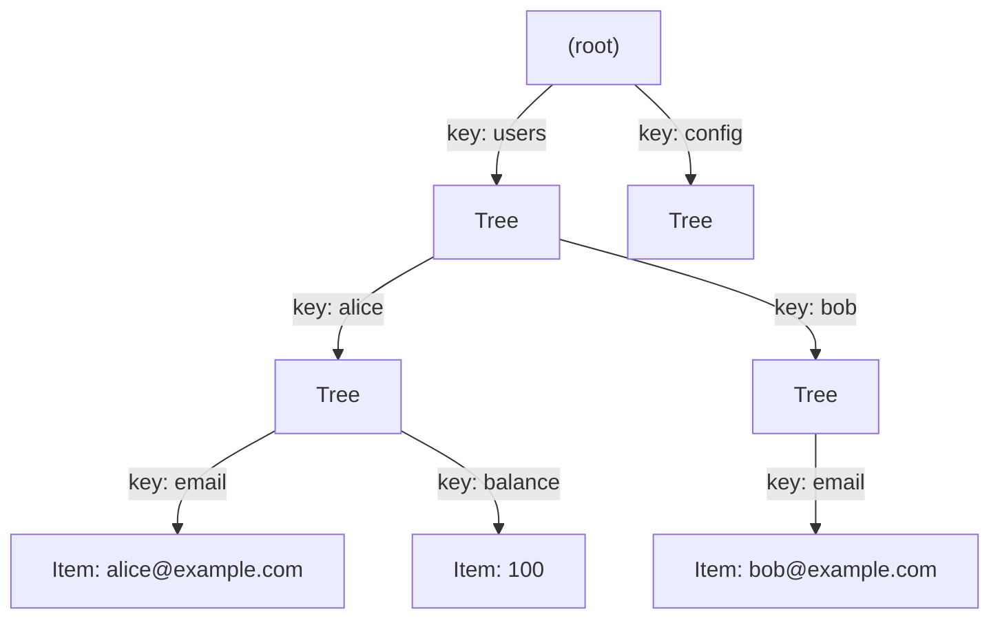

# Elements and Subtree Hierarchies

> **Prerequisites:** [Getting Started](03-getting-started.md)

## What Is an Element?

An [`Element`](@ref grovedb::Element) is the unit of storage in GroveDB. It's not raw bytes — it's a typed wrapper with four variants:



- **Item** — your data. The actual payload: a serialized protobuf, a raw balance, a public key. Think of it as a leaf node.
- **Tree** — creates a new subtree. The element itself is empty, but it opens a new namespace you can insert elements into. Analogous to creating a new LevelDB column family.
- **SumTree** — like Tree, but automatically maintains a running sum of all SumItem children. Useful for tracking total balances or vote counts without iteration.
- **SumItem** — an integer value (`int64_t`) that lives inside a SumTree and contributes to its sum.

## Creating Elements

Elements are created via static factory methods that return [`Result<Element, Error>`](@ref grovedb::Result):

```cpp
auto item = grovedb::Element::Item(grovedb::Bytes::FromString("hello"));
auto tree = grovedb::Element::EmptyTree();
auto sum_tree = grovedb::Element::EmptySumTree();
auto sum_item = grovedb::Element::SumItem(42);
```

Each factory returns a [`Result`](@ref grovedb::Result) because the element is serialized to its internal bincode representation. In practice, these calls succeed unless memory allocation fails.

## Building a Hierarchy

The power of GroveDB comes from nesting trees within trees. Here's how to build a user directory:



Build it step by step — each subtree insert requires the parent tree to exist first:

```cpp
grovedb::Path root{};

// Step 1: Create the "users" subtree at root
grovedb::Element::EmptyTree().and_then([&](grovedb::Element e) {
  return db.Put(root, grovedb::Bytes::FromString("users"), e);
});

// Step 2: Create the "alice" subtree under "users"
grovedb::Path users{grovedb::Bytes::FromString("users")};
grovedb::Element::EmptyTree().and_then([&](grovedb::Element e) {
  return db.Put(users, grovedb::Bytes::FromString("alice"), e);
});

// Step 3: Insert data under "alice"
grovedb::Path alice{
  grovedb::Bytes::FromString("users"),
  grovedb::Bytes::FromString("alice")
};
grovedb::Element::Item(grovedb::Bytes::FromString("alice@example.com"))
  .and_then([&](grovedb::Element e) {
    return db.Put(alice, grovedb::Bytes::FromString("email"), e);
  });
```

The order matters: you can't insert into `["users", "alice"]` until both the `users` and `alice` subtrees exist.

For the complete example, see [`contrib/examples/subtree_hierarchy.cpp`](../libgrovedb/contrib/examples/subtree_hierarchy.cpp).

## Paths Explained

A [`Path`](@ref grovedb::Path) is `std::vector<`[`Bytes`](@ref grovedb::Bytes)`>` — a sequence of byte segments navigating the subtree hierarchy:

```cpp
grovedb::Path root{};                                         // the root tree
grovedb::Path users{grovedb::Bytes::FromString("users")};    // one level deep
grovedb::Path alice{                                          // two levels deep
  grovedb::Bytes::FromString("users"),
  grovedb::Bytes::FromString("alice")
};
```

The empty path `{}` always refers to the root tree. Each additional segment navigates one level deeper into the hierarchy.

## Inspecting the Hierarchy

GroveDB provides several methods for exploring tree structure:

```cpp
// Check if a path leads to a valid subtree
auto exists = db.SubtreeExists(alice_path);  // grovedb::Result<Costed<bool>, Error>

// Check if a subtree is empty (has no children)
auto empty = db.IsEmptyTree(alice_path);     // grovedb::Result<Costed<bool>, Error>

// Discover all subtree paths under a given root
auto found = db.FindSubtrees(root);          // grovedb::Result<Costed<std::vector<Path>>, Error>
```

[`FindSubtrees()`](@ref grovedb::Db::FindSubtrees) recursively discovers the entire subtree hierarchy, returning every path. Useful for debugging and tree visualization.

## Why This Hierarchy Matters

Each subtree is its own Merk tree with its own root hash. The parent tree stores that hash as the value of the Tree element. So the top-level root hash transitively commits to every element in every subtree.

If you change Alice's email:
1. The `alice` subtree hash changes
2. The `users` subtree hash changes (because it contains the `alice` tree element)
3. The root hash changes

This is exactly like how changing one transaction changes the Merkle root in a block header — but hierarchically. One 32-byte root hash proves the entire database.

For a blockchain, this means a light client can verify that "Alice's email is alice@example.com" by checking a hierarchical Merkle proof against the state root in the block header. The proof chains through each level: root → users → alice → email.

## SumItem Placement

SumItems must be placed inside a SumTree, not in a regular Tree or at root:

```cpp
// Create the SumTree
grovedb::Element::EmptySumTree().and_then([&](grovedb::Element e) {
  return db.Put(root, grovedb::Bytes::FromString("balances"), e);
});

// Insert SumItems into the SumTree
grovedb::Path balances{grovedb::Bytes::FromString("balances")};
grovedb::Element::SumItem(1000).and_then([&](grovedb::Element e) {
  return db.Put(balances, grovedb::Bytes::FromString("alice"), e);
});
```

See [Advanced Topics — Sum Trees](10-advanced-topics.md#sum-trees) for details on querying aggregate sums.

For the complete element types demonstration, see [`contrib/examples/element_types.cpp`](../libgrovedb/contrib/examples/element_types.cpp).
