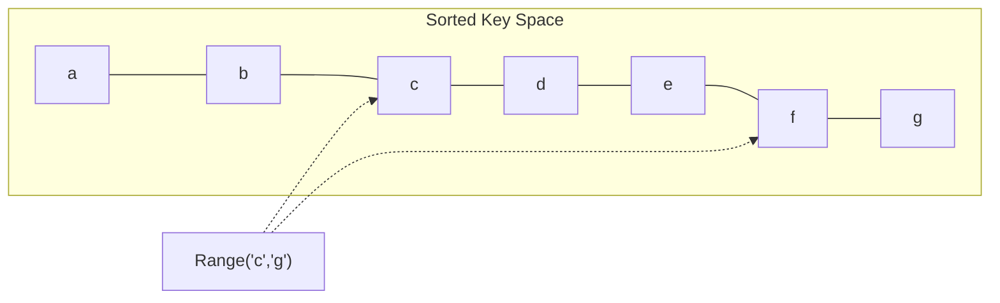
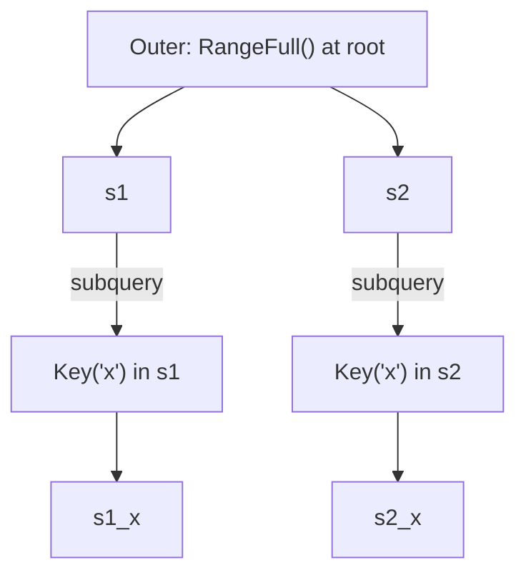

# Queries

> **Prerequisites:** [Basic Operations](05-basic-operations.md)

## Beyond Single-Key Lookups

[`Get`](@ref grovedb::Db::Get) is like looking up a UTXO by outpoint — one key, one value. Queries are like asking "show me all UTXOs for this address" — range-based, filterable, and *provable*. This is what GroveDB was built for.

## Query Items

A [`QueryItem`](@ref grovedb::QueryItem) is a predicate that selects keys from a subtree. GroveDB provides 10 factory methods covering every range pattern:

| Factory | Matches | Example |
|---------|---------|---------|
| `Key(k)` | Exact key | `Key({'e'})` → `e` |
| `Range(a, b)` | `[a, b)` | `Range({'c'}, {'g'})` → `c,d,e,f` |
| `RangeInclusive(a, b)` | `[a, b]` | `RangeInclusive({'c'}, {'g'})` → `c,d,e,f,g` |
| `RangeFull()` | All keys | `RangeFull()` → everything |
| `RangeFrom(a)` | `[a, +∞)` | `RangeFrom({'f'})` → `f,g,h,...` |
| `RangeTo(b)` | `(-∞, b)` | `RangeTo({'d'})` → `a,b,c` |
| `RangeToInclusive(b)` | `(-∞, b]` | `RangeToInclusive({'d'})` → `a,b,c,d` |
| `RangeAfter(a)` | `(a, +∞)` | `RangeAfter({'c'})` → `d,e,f,...` |
| `RangeAfterTo(a, b)` | `(a, b)` | `RangeAfterTo({'b'}, {'f'})` → `c,d,e` |
| `RangeAfterToInclusive(a, b)` | `(a, b]` | `RangeAfterToInclusive({'b'}, {'f'})` → `c,d,e,f` |

Because Merk trees maintain keys in sorted order (AVL property), range queries are efficient — they traverse only the relevant portion of the tree.



## Path Queries

A [`PathQuery`](@ref grovedb::PathQuery) combines a path, query predicates, and optional pagination:

```cpp
auto pq = grovedb::PathQuery::New(
  path,                                    // subtree to query
  {grovedb::QueryItem::RangeFull()},       // predicates
  /*limit=*/10,                            // max results (0 = no limit)
  /*offset=*/0                             // skip first N results
);
```

Multiple query items in the same [`PathQuery`](@ref grovedb::PathQuery) are combined as a union — results matching *any* of the items are returned:

```cpp
// Get keys "a", "c", and everything from "f" onward
auto pq = grovedb::PathQuery::New(path, {
  grovedb::QueryItem::Key({'a'}),
  grovedb::QueryItem::Key({'c'}),
  grovedb::QueryItem::RangeFrom({'f'}),
});
```

## Query Execution Methods

Different query methods return data in different formats:

| Method | Returns | Use when |
|--------|---------|----------|
| [`QueryValues`](@ref grovedb::Db::QueryValues) | `vector<Bytes>` | You want raw byte values only |
| [`QueryItemsOrSums`](@ref grovedb::Db::QueryItemsOrSums) | `vector<QueryItemOrSum>` | Querying mixed trees with Items and SumItems |
| [`QuerySums`](@ref grovedb::Db::QuerySums) | `vector<int64_t>` | Querying SumTrees for aggregate values |
| [`QueryRaw`](@ref grovedb::Db::QueryRaw) | `vector<QueryResultElement>` | You want full Element objects with optional keys and paths |
| [`QueryKeysOptional`](@ref grovedb::Db::QueryKeysOptional) | `vector<PathKeyElement>` | You want path+key+element triples (follows references) |
| [`QueryRawKeysOptional`](@ref grovedb::Db::QueryRawKeysOptional) | `vector<PathKeyElement>` | Same as above, without following references |

All query methods return results wrapped in [`Costed`](@ref grovedb::Costed)`<`[`QueryData<T>`](@ref grovedb::QueryData)`>`, where [`QueryData`](@ref grovedb::QueryData) bundles the results with a skip count:

```cpp
auto result = db.QueryValues(pq);
if (result.has_value()) {
  auto& values = result->value().m_data;      // the results
  auto skipped = result->value().m_skipped;    // number of results skipped (offset)
  auto& cost = result->cost();                 // OperationCost
}
```

### QueryRaw result types

[`QueryRaw`](@ref grovedb::Db::QueryRaw) takes a `result_type` parameter controlling how much context is included:

| `result_type` | Returns | Fields populated |
|---------------|---------|-----------------|
| `0` | Element only | `m_element` |
| `1` | Key + Element | `m_key`, `m_element` |
| `2` | Path + Key + Element | `m_path`, `m_key`, `m_element` |

## Hierarchical Subqueries

[`PathQuery::NewWithSubquery`](@ref grovedb::PathQuery::NewWithSubquery) enables two-level queries: for each result at the outer level, run a subquery one level deeper. This is how you query across subtrees without making multiple round trips.

Example: "for each user subtree, get the element with key 'x'":



```cpp
grovedb::Path root{};
grovedb::Path empty_subquery_path{};

auto result = grovedb::PathQuery::NewWithSubquery(
  root,
  {grovedb::QueryItem::RangeFull()},    // outer: all subtrees at root
  /*limit=*/0,
  /*offset=*/0,
  empty_subquery_path,                   // no additional path navigation
  {grovedb::QueryItem::Key({'x'})}       // subquery: get 'x' from each
).and_then([&](grovedb::PathQuery q) {
  return db.QueryValues(q);
});
```

The `subquery_path` parameter allows navigating deeper before applying the subquery items. If it's empty, the subquery runs directly on each result subtree. If set to e.g. `{"documents"}`, it first navigates to the "documents" subtree within each result before applying the subquery predicates.

For the complete hierarchical query example, see [`contrib/examples/hierarchical_query.cpp`](../libgrovedb/contrib/examples/hierarchical_query.cpp).

## Multi-Queries

[`QueryManyRaw`](@ref grovedb::Db::QueryManyRaw) executes multiple independent queries atomically, returning merged results:

```cpp
std::vector<grovedb::Db::RawQuerySpec> queries{
  {path1, items1, /*limit=*/10, /*offset=*/0},
  {path2, items2, /*limit=*/5,  /*offset=*/0},
};
auto result = db.QueryManyRaw(queries, /*result_type=*/2);
```

Use case: when you need data from unrelated parts of the tree in one shot — e.g., fetching both user profile data and contract configuration in a single atomic read.

For all query patterns demonstrated, see [`contrib/examples/range_queries.cpp`](../libgrovedb/contrib/examples/range_queries.cpp) and [`contrib/examples/multi_query.cpp`](../libgrovedb/contrib/examples/multi_query.cpp).
