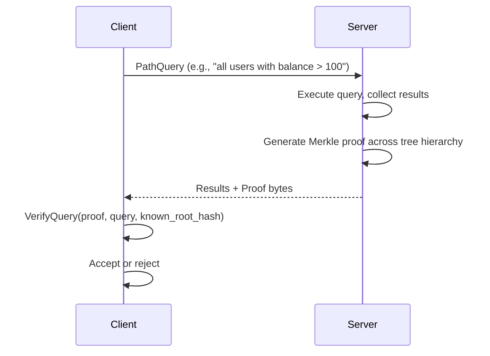
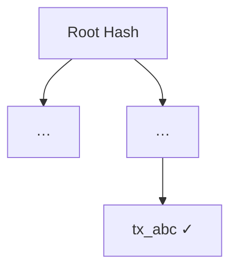
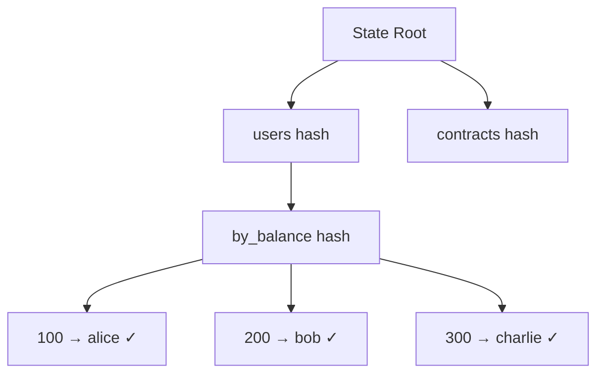

# Cryptographic Proofs

> **Prerequisites:** [Queries](06-queries.md)

This is GroveDB's reason for existing. Every query can produce a cryptographic proof that a light client can verify without trusting the server.

## Why Proofs Matter

In a blockchain, full nodes answer queries for light clients. Without proofs, the light client trusts the full node blindly — the node could omit results, fabricate data, or return stale state. With proofs, the light client verifies every answer against the state root hash committed in the block header.

You already know this pattern from Bitcoin's SPV proofs: a transaction's Merkle path from leaf to block header root proves inclusion. GroveDB extends this from simple key lookups to complex range queries and secondary index queries — across a hierarchy of trees.

A valid proof must guarantee three properties:
- **Completeness** — the result set contains all matching records, none are omitted
- **Correctness** — no records in the result set have been fabricated or modified
- **Freshness** — the proof is against the most recent state, not a stale version

## How Proofs Work



The proof contains sibling hashes at each level of the hierarchy. The client reconstructs root hashes bottom-up — starting from the leaf data, hashing up through each subtree level — and checks the final hash against the known state root from the block header.

If any data was tampered with (changed, omitted, or fabricated), the hashes won't match. The math is the same as Bitcoin's Merkle proofs, extended hierarchically.

## Generating a Proof

```cpp
auto proof = grovedb::PathQuery::New(root, {grovedb::QueryItem::RangeFull()})
         .and_then([&](grovedb::PathQuery q) {
           return db.Prove(q);
         });

if (proof.has_value()) {
  auto& proof_bytes = proof->value();  // Costed<Bytes>
  // proof_bytes.value() contains the serialized proof
}
```

[`Prove`](@ref grovedb::Db::Prove) returns opaque proof bytes. The proof is compact because Merk's AVL structure produces efficient range proofs — proof size is O(log n) per tree level, independent of the total data size.

The optional `decrease_limit_on_empty` parameter (default `true`) controls whether empty subtrees count against the query limit.

## Verifying a Proof

```cpp
auto root_hash = db.GetRootHash();

auto verified = grovedb::PathQuery::New(root, {grovedb::QueryItem::RangeFull()})
          .and_then([&](grovedb::PathQuery q) {
            return db.VerifyQuery(proof_bytes, q);
          });

if (verified.has_value()) {
  auto& result = verified->value();
  // result.m_root_hash — the 32-byte root hash derived from the proof
  // result.m_entries — vector<PathKeyElement> with verified data
  bool valid = (result.m_root_hash == root_hash->value());
}
```

The critical point: **verification is stateless**. A light client with only the 32-byte root hash (from a block header) can verify any query result. No database access needed. This is the entire point of GroveDB.

The [`ProofVerifyResult`](@ref grovedb::Db::ProofVerifyResult) contains:
- `m_root_hash` — the root hash reconstructed from the proof (compare against the known state root)
- `m_entries` — `vector<`[`PathKeyElement`](@ref grovedb::PathKeyElement)`>`, each with a path, key, and optional element (present for existing keys, absent for non-existing keys in absence proofs)

## Proof Verification Variants

| Method | Behavior |
|--------|----------|
| [`VerifyQuery`](@ref grovedb::Db::VerifyQuery) | Strict verification — proof must be succinct (no extra data) |
| [`VerifySubsetQuery`](@ref grovedb::Db::VerifySubsetQuery) | Non-strict — proof may contain extra data beyond what the query asked for |
| [`VerifyQueryWithAbsenceProof`](@ref grovedb::Db::VerifyQueryWithAbsenceProof) | Proves keys are *not* in the database (entries with `m_element = nullopt`) |
| [`VerifySubsetQueryWithAbsenceProof`](@ref grovedb::Db::VerifySubsetQueryWithAbsenceProof) | Combines subset verification with absence proofs |
| [`VerifyQueryWithOptions`](@ref grovedb::Db::VerifyQueryWithOptions) | Full control over verification behavior |
| [`VerifyChainedQueries`](@ref grovedb::Db::VerifyChainedQueries) | Verifies a sequence of dependent queries |

## Absence Proofs

Absence proofs demonstrate that a key does **not** exist in the database. This is essential for queries like "this account has no outstanding debt" or "this identity is not registered."

```cpp
// Insert "a", "c", "e" — keys "b" and "d" are absent
// Generate a proof for all five keys
auto proof = grovedb::PathQuery::New(root, {
  grovedb::QueryItem::Key({'a'}),
  grovedb::QueryItem::Key({'b'}),
  grovedb::QueryItem::Key({'c'}),
  grovedb::QueryItem::Key({'d'}),
  grovedb::QueryItem::Key({'e'}),
}, /*limit=*/100).and_then([&](grovedb::PathQuery q) {
  return db.Prove(q);
});

// Verify with absence proofs enabled
auto verified = grovedb::PathQuery::New(root, /* same items */, /*limit=*/100)
  .and_then([&](grovedb::PathQuery q) {
    return db.VerifyQueryWithAbsenceProof(proof_bytes, q);
  });

// In the results:
// entries for "a", "c", "e" have m_element with a value
// entries for "b", "d" have m_element = nullopt (proven absent)
```

The proof works by showing the neighboring keys that *do* exist, demonstrating there's no room for the absent key in the sorted tree. This is the same principle as Bitcoin's Merkle tree inability to "hide" a transaction — the structure is deterministic.

For the complete absence proof example, see [`contrib/examples/absence_proofs.cpp`](../libgrovedb/contrib/examples/absence_proofs.cpp).

## Chained Query Verification

[`VerifyChainedQueries`](@ref grovedb::Db::VerifyChainedQueries) verifies a sequence of queries where each depends on the result of the previous one. The first result key of each query is appended to the next query's path.

```cpp
auto result = db.VerifyChainedQueries(
  proof_bytes,
  first_query,
  {&second_query, &third_query}
);
// result->value().m_query_results is a vector<vector<PathKeyElement>>
// one result set per query in the chain
```

Use case: "get user, then get their documents" — the user's ID from the first query determines the path for the second query. A single proof covers the entire chain.

For chained query examples, see [`contrib/examples/chained_queries.cpp`](../libgrovedb/contrib/examples/chained_queries.cpp).

## Custom Verification Options

[`VerifyQueryWithOptions`](@ref grovedb::Db::VerifyQueryWithOptions) provides fine-grained control:

```cpp
auto result = db.VerifyQueryWithOptions(
  proof_bytes,
  query,
  /*absence_proofs=*/true,        // verify absent keys
  /*verify_succinctness=*/false,   // allow extra data in proof
  /*include_empty_trees=*/false    // exclude empty subtrees from results
);
```

## The Tree-of-Trees Advantage

Because GroveDB organizes secondary indexes as subtrees within the hierarchy, a single proof can span multiple trees and answer queries that no flat Merkle tree could prove efficiently.

A flat Merkle tree proves "this key exists":



GroveDB proves "these are *all* matching results, and no others exist in this range":



That's the difference between simple key inclusion and provable secondary index queries.

For complete proof generation and verification, see [`contrib/examples/proof_generation.cpp`](../libgrovedb/contrib/examples/proof_generation.cpp).
