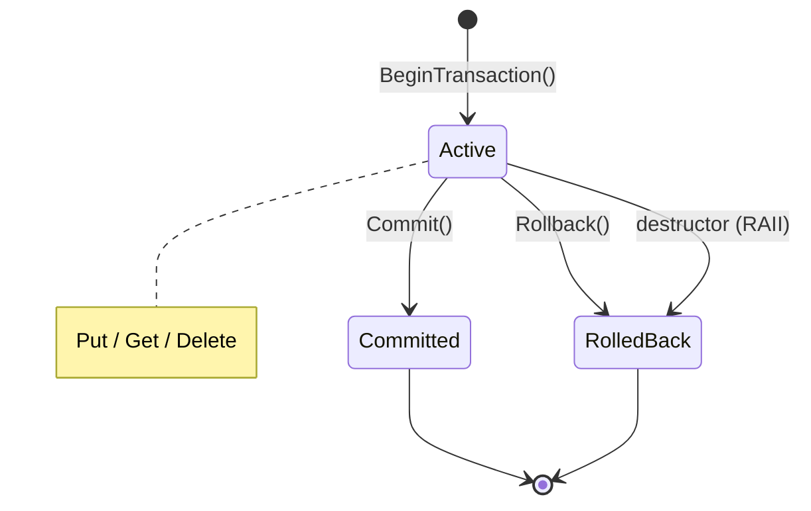

# Transactions

> **Prerequisites:** [Basic Operations](05-basic-operations.md)

## Optimistic Transactions

GroveDB uses RocksDB's optimistic transaction model: no locks are acquired during operations, and conflicts are detected at commit time. This mirrors how block processing typically works — one thread processes a block's worth of state changes, then commits atomically. Contention is rare in blockchain workloads.

## Transaction Lifecycle



### Begin

```cpp
auto txn = db.BeginTransaction();
if (!txn.has_value()) {
  // handle error
}
```

### Operations Within a Transaction

Pass the transaction as the last argument to any operation:

```cpp
db.Put(path, key, element, *txn);       // write within transaction
auto get = db.Get(path, key, *txn);     // read within transaction (sees uncommitted writes)
auto get2 = db.Get(path, key);          // read outside transaction (isolation — doesn't see uncommitted)
```

Writes within a transaction are **isolated** — they're visible to reads within the same transaction but not to reads outside it. This is standard snapshot isolation.

### Commit

```cpp
auto commit_result = db.Commit(*txn);
if (!commit_result.has_value()) {
  // conflict detected or I/O error
}
// commit_result->m_seek_count, etc.
```

[`Commit`](@ref grovedb::Db::Commit) returns an [`OperationCost`](@ref grovedb::OperationCost) on success, reflecting the cost of flushing the transaction to storage. After commit, the transaction handle is consumed — no further operations are possible on it.

### Rollback

Explicit rollback discards all uncommitted changes:

```cpp
auto rb = db.Rollback(*txn);
```

### RAII Auto-Rollback

If a [`Transaction`](@ref grovedb::Transaction) is destroyed without an explicit [`Commit`](@ref grovedb::Db::Commit) or [`Rollback`](@ref grovedb::Db::Rollback), the destructor automatically rolls back:

```cpp
{
  auto txn = db.BeginTransaction();
  db.Put(path, key, element, *txn);
  // txn destroyed here without commit — changes discarded
}
// key does not exist in the database
```

The destructor guarantees cleanup — you can't accidentally leave dangling transaction state.

## Batches Within Transactions

[`ApplyBatch`](@ref grovedb::Db::ApplyBatch) accepts an optional transaction argument for operations that combine batch efficiency with transactional safety:

```cpp
auto result = db.ApplyBatch(ops, options, *txn);
```

This applies all batch operations within the transaction context. The batch is not visible outside the transaction until commit. See [Batch Operations](09-batch-operations.md) for details on building batches.

## Complete Example

```cpp
// 1. Begin transaction
auto txn = db.BeginTransaction();

// 2. Write within transaction
auto elem = grovedb::Element::Item(grovedb::Bytes::FromString("txn_value"));
db.Put(root, grovedb::Bytes::FromString("txn_key"), *elem, *txn);

// 3. Read within transaction — visible
auto get_in = db.Get(root, grovedb::Bytes::FromString("txn_key"), *txn);
// get_in.has_value() == true

// 4. Read outside transaction — not visible (isolation)
auto get_out = db.Get(root, grovedb::Bytes::FromString("txn_key"));
// get_out.has_value() == false

// 5. Commit — now visible to all readers
auto commit = db.Commit(*txn);
auto get_after = db.Get(root, grovedb::Bytes::FromString("txn_key"));
// get_after.has_value() == true
```

For the complete transaction lifecycle with commit, rollback, and RAII paths, see [`contrib/examples/transaction_lifecycle.cpp`](../libgrovedb/contrib/examples/transaction_lifecycle.cpp).
