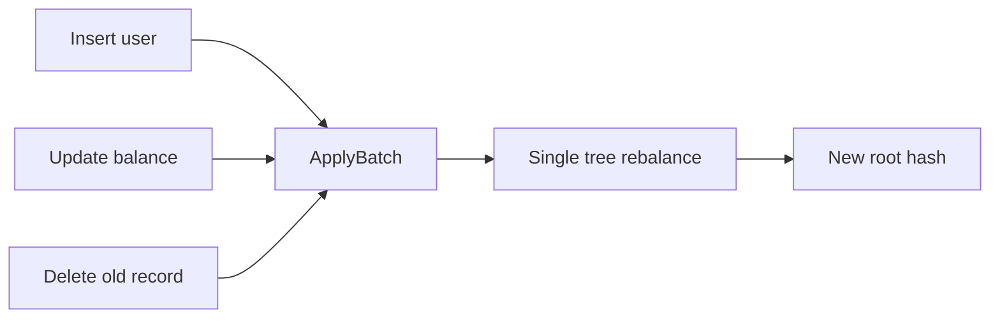

# Batch Operations

> **Prerequisites:** [Basic Operations](05-basic-operations.md), [Elements and Trees](04-elements-and-trees.md)

## Why Batches?

Processing a block means applying many state changes. With individual `Put` calls, the tree rebalances after each one — O(log n) hash recomputations per operation. A batch applies all operations atomically with a single rebalance pass, amortizing the cost.

Similar to RocksDB's `WriteBatch`, but for an authenticated tree. Instead of batching raw key-value writes, you batch typed operations across the tree hierarchy.



## Operation Types

[`BatchOperation`](@ref grovedb::BatchOperation) provides five factory methods:

| Factory | Behavior |
|---------|----------|
| `InsertOnly(path, key, element)` | Insert a new element; **fails if the key already exists** |
| `InsertOrReplace(path, key, element)` | Insert or overwrite — upsert semantics |
| `Replace(path, key, element)` | Replace an existing element; **fails if the key does not exist** |
| `Delete(path, key)` | Delete the element at the given path and key |
| `DeleteTree(path, key, tree_type)` | Delete an entire subtree (default: `TreeType::NormalTree`) |

## Building and Applying a Batch

```cpp
#include <grovedb/batch.h>  // for BatchOperation, BatchApplyOptions

// Create elements
auto new_elem = grovedb::Element::Item(grovedb::Bytes::FromString("brand_new"));
auto replace_elem = grovedb::Element::Item(grovedb::Bytes::FromString("new_value"));
auto upsert_elem = grovedb::Element::Item(grovedb::Bytes::FromString("upserted"));

// Build the batch
std::vector<grovedb::BatchOperation> ops{
  grovedb::BatchOperation::InsertOnly(
    root, grovedb::Bytes::FromString("new_key"), *new_elem),
  grovedb::BatchOperation::InsertOrReplace(
    root, grovedb::Bytes::FromString("upsert_key"), *upsert_elem),
  grovedb::BatchOperation::Replace(
    root, grovedb::Bytes::FromString("existing_key"), *replace_elem),
  grovedb::BatchOperation::Delete(
    root, grovedb::Bytes::FromString("old_key")),
  grovedb::BatchOperation::DeleteTree(
    root, grovedb::Bytes::FromString("old_tree")),
};

// Apply atomically
grovedb::BatchApplyOptions options;
auto result = db.ApplyBatch(ops, options);
```

If any operation in the batch fails validation, none are applied. The batch is all-or-nothing.

## Batch Options

[`BatchApplyOptions`](@ref grovedb::BatchApplyOptions) controls validation behavior:

| Field | Default | Description |
|-------|---------|-------------|
| `m_validate_insertion_does_not_override` | `false` | Check that InsertOnly keys don't exist before applying |
| `m_validate_insertion_does_not_override_tree` | `false` | Check that insertions don't override existing trees |
| `m_allow_deleting_non_empty_trees` | `false` | Allow DeleteTree on trees that still have children |
| `m_deleting_non_empty_trees_returns_error` | `true` | Return error (vs. silently skip) when deleting non-empty trees |
| `m_disable_operation_consistency_check` | `false` | Skip internal consistency validation |
| `m_base_root_storage_is_free` | `true` | Don't count root storage costs |

For typical block processing, the defaults are appropriate. Set `m_allow_deleting_non_empty_trees = true` if your batch needs to remove subtrees that may still contain data.

## Batches Within Transactions

Batches can be applied within a transaction for combined atomicity:

```cpp
auto txn = db.BeginTransaction();
auto result = db.ApplyBatch(ops, options, *txn);
// batch changes are isolated until commit
auto commit = db.Commit(*txn);
```

This is useful when a block's state transitions include both batched operations and individual operations that need to share transactional context.

## Tree Types for DeleteTree

When deleting a subtree, specify the [`TreeType`](@ref grovedb::TreeType) to match what was originally inserted:

```cpp
grovedb::BatchOperation::DeleteTree(path, key, grovedb::TreeType::NormalTree);
grovedb::BatchOperation::DeleteTree(path, key, grovedb::TreeType::SumTree);
```

Available tree types: `NormalTree`, `SumTree`, `BigSumTree`, `CountTree`, `CountSumTree`, `ProvableCountTree`, `ProvableCountSumTree`.

For the complete batch operations example, see [`contrib/examples/batch_operations.cpp`](../libgrovedb/contrib/examples/batch_operations.cpp). For batches within transactions, see [`contrib/examples/batch_in_transaction.cpp`](../libgrovedb/contrib/examples/batch_in_transaction.cpp).
